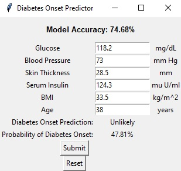
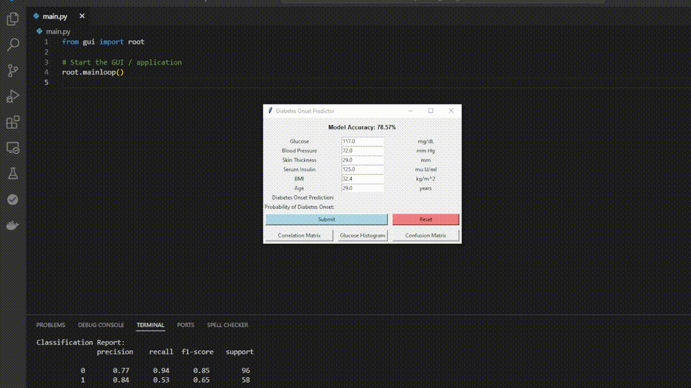
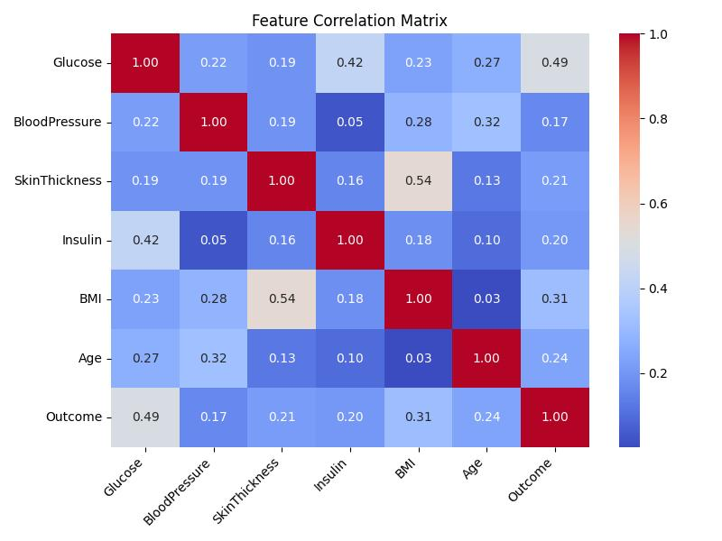
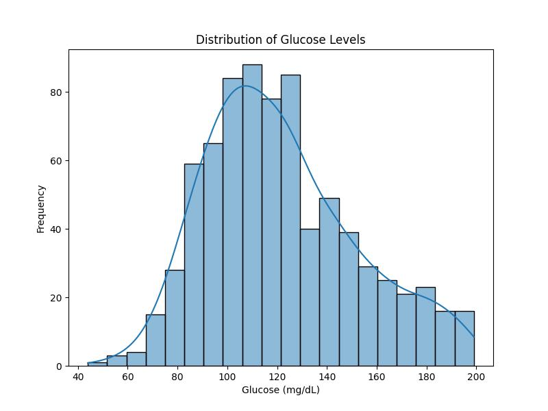
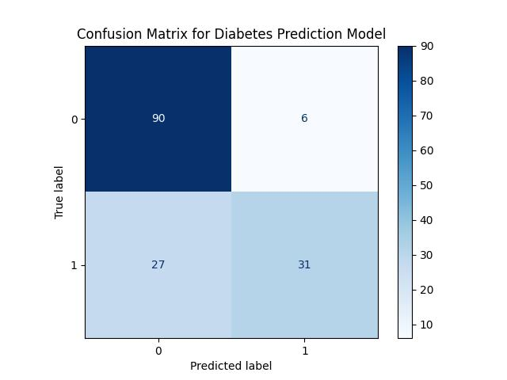

# Diabetes Risk Predictor

<!-- TABLE OF CONTENTS -->
<details>
  <summary>Table of Contents</summary>
  <ol>
    <li>
      <a href="#about-the-project">About The Project</a>
    </li>
    <li>
    <a href="#dataset">Dataset</a>
    </li>
    <li>
      <a href="#getting-started">Getting Started</a>
      <ul>
        <li><a href="#prerequisites">Prerequisites</a></li>
      </ul>
    </li>
    <li><a href="#usage">Usage</a></li>
    <li><a href="#visualizations--descriptive-methods">Visualizations / Descriptive Methods</a></li>
      <ul>
        <li><a href="#correlation-matrix">Correlation Matrix</a></li>
        <li><a href="#glucose-histogram">Glucose Histogram</a></li>
        <li><a href="#confusion-matrix">Confusion Matrix</a></li>
      </ul>
    <li><a href="#contact">Contact</a></li>
  </ol>
</details>

<!-- ABOUT THE PROJECT -->
## About The Project

The **Diabetes Risk Predictor** is a supervised machine learning application designed to predict diabetes onset based on real-world health metrics. Using logistic regression, the tool evaluates features such as glucose levels, blood pressure, BMI, and age, providing healthcare professionals with insights for early intervention.

This project emphasizes building a machine learning application as a complete software solution, from data preprocessing and model training to creating a user-friendly graphical interface. The primary focus is on the development process, not maximizing performance. In this tool, each input factor reflects key features of diabetes risk, with the model trained on a robust dataset to improve its predictive accuracy.

Key elements of the project include:
- **Data Processing**: Using `pandas` and `numpy` for data handling, cleaning, and feature preparation.
- **Machine Learning**: Implementing logistic regression utilizing `scikit-learn` for model building and evaluation to provide accuracy and classification reports.
- **User Interface**: A graphical interface, built with Python's `tkinter` module, allowing users to input patient data and receive predictions along with a probability score.

### Note
It is important to recognize that diabetes is a highly personalized condition, influenced by factors like genetics, lifestyle, and environment. The limited dataset and features used in this project are a simplification, and the results are not intended to be a definitive prediction tool. Instead, this project serves as a proof of concept, demonstrating how machine learning can be applied to healthcare challenges.

## Dataset

The dataset used in this project is sourced from [Kaggle's Diabetes Dataset](https://www.kaggle.com/datasets/hasibur013/diabetes-dataset). It contains health metrics collected to help predict the likelihood of diabetes onset.

### Features
The dataset includes the following features:
- **Glucose** (mg/dL): Blood sugar levels.
- **Blood Pressure** (mm Hg): Diastolic blood pressure.
- **Skin Thickness** (mm): Triceps skinfold thickness.
- **Serum Insulin** (mu U/ml): Insulin levels.
- **BMI** (kg/m²): Body Mass Index.
- **Age** (years): Patient's age.
- **Outcome**: Binary target variable (1 = diabetes likely, 0 = diabetes unlikely).

This dataset was selected as a starting point for building a proof-of-concept predictive tool.

<!-- GETTING STARTED -->
## Getting Started

This project may be run directly from an IDE that support Python.

### Prerequisites

A user requires 5 libraries for the program to operate:

* pandas
  ```sh
  python -m pip install pandas
  ```
* NumPy
  ```sh
  python -m pip install numpy
  ```
* scikit-learn
  ```sh
  python -m pip install scikit-learn
  ```
* matplotlib
  ```sh
  python -m pip install matplotlib
  ```
* seaborn
  ```sh
  python -m pip install seaborn
  ```

<!-- USAGE -->
## Usage

Upon running the program, some relevant data will be output to the terminal. A new window will open, allowing the user to input data and use the trained model to make a prediction.

The tool provides:

- Predictions indicating whether diabetes onset is "Likely" or "Unlikely."
- A confidence percentage for the prediction.
- Default input values based on the median of the training data for convenience.

### Example Usage:

1. Enter metrics such as glucose level and BMI in the provided fields.
2. Click **"Submit"** to receive a prediction along with the confidence percentage.
3. Use the **"Reset"** button to clear inputs and start fresh.




<!-- VISUALIZATIONS / DESCRIPTIVE METHODS -->
## Visualizations / Descriptive Methods

This tool includes three visualization features to better understand the data and model performance:

### Correlation Matrix
Displays the relationships between features in the dataset.



### Glucose Histogram
Shows the distribution of glucose levels in the dataset.



### Confusion Matrix
Evaluates the performance of the logistic regression model.



<!-- License -->
## License

This project is licensed under the MIT License.

<!-- CONTACT -->
## Contact

Logan Drda - logan.drda.cs@gmail.com