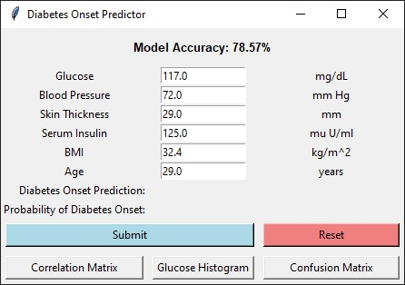

# Diabetes Risk Predictor

## Table of Contents
- [About the Project](#about-the-project)
- [Dataset](#dataset)
- [Getting Started](#getting-started)
- [Usage](#usage)
- [Visualizations / Descriptive Methods](#visualizations--descriptive-methods)
- [Contact](#contact)

<!-- ABOUT THE PROJECT -->
## About The Project
The **Diabetes Risk Predictor** is a supervised machine learning application designed to predict the likelihood of diabetes onset based on key health metrics. Using logistic regression, the tool evaluates features such as glucose levels, blood pressure, BMI, and age, providing healthcare professionals with insights for early intervention. The model classifies patients as either "Likely" or "Unlikely" to develop diabetes.

This project focuses on building a complete machine learning application, from data preprocessing and model training to creating a user-friendly graphical interface. The primary goal is to demonstrate how machine learning can be applied to healthcare, rather than maximizing model performance. It is important to note that diabetes is a highly personalized condition, influenced by genetics, lifestyle, and environment. Due to the limited dataset and features used, the results are intended as a proof of concept rather than a definitive diagnostic tool.

Key elements of the project include:
- **Data Processing**: Cleaning and preparing data using `pandas` and `numpy` for use in logistic regression.
- **Machine Learning**: Building and evaluating a logistic regression model with `scikit-learn` to classify the risk of diabetes onset based on health metrics.
- **User Interface**: A straightforward graphical interface built with Python's `tkinter` that allows users to input patient data and receive predictions with confidence scores.

### Note
It is important to recognize that diabetes is a highly personalized condition, influenced by factors like genetics, lifestyle, and environment. The limited dataset and features used in this project are a simplification, and the results are not intended to be a definitive prediction tool. Instead, this project serves as a proof of concept, demonstrating how machine learning can be applied to healthcare challenges.

## Dataset
The dataset used in this project is sourced from [Kaggle's Diabetes Dataset](https://www.kaggle.com/datasets/hasibur013/diabetes-dataset). It contains health metrics collected to help predict the likelihood of diabetes onset.

### Features
The dataset includes the following features:
- **Glucose** (mg/dL): Blood sugar levels.
- **Blood Pressure** (mm Hg): Diastolic blood pressure.
- **Skin Thickness** (mm): Triceps skinfold thickness.
- **Serum Insulin** (mu U/ml): Insulin levels.
- **BMI** (kg/m²): Body Mass Index.
- **Age** (years): Patient's age.
- **Outcome**: Binary target variable (1 = diabetes likely, 0 = diabetes unlikely).

This dataset was selected as a starting point for building a proof-of-concept predictive tool.

<!-- GETTING STARTED -->
## Getting Started

### Prerequisites
There are 5 required libraries for the program:

* pandas
  ```sh
  python -m pip install pandas
  ```
* NumPy
  ```sh
  python -m pip install numpy
  ```
* scikit-learn
  ```sh
  python -m pip install scikit-learn
  ```
* matplotlib
  ```sh
  python -m pip install matplotlib
  ```
* seaborn
  ```sh
  python -m pip install seaborn
  ```

### Running the Program
1. Clone or download the repository to your local machine.
2. Open the project an IDE or text editor that supports Python.
3. Run the `main.py` file to start the program.

<!-- USAGE -->
## Usage
Upon running the program, some relevant data will be output to the terminal. A new window will open, allowing the user to input data and use the trained model to make a prediction.

The tool provides:

- Predictions indicating whether diabetes onset is "Likely" or "Unlikely."
- A confidence percentage for the prediction.
- Default input values based on the median of the training data for convenience.

### Example Usage:
1. Enter metrics such as glucose level and BMI in the provided fields.
2. Click **"Submit"** to receive a prediction along with the confidence percentage.
3. Use the **"Reset"** button to clear inputs and start fresh.




<!-- VISUALIZATIONS / DESCRIPTIVE METHODS -->
## Visualizations / Descriptive Methods
This tool includes three visualization features to better understand the data and model performance:

### Correlation Matrix
Displays the relationships between features in the dataset.


### Glucose Histogram
Shows the distribution of glucose levels in the dataset.


### Confusion Matrix
Evaluates the performance of the logistic regression model.


<!-- License -->
## License:
This project is licensed under the MIT License - see the [LICENSE](LICENSE) file for details.

<!-- CONTACT -->
## Contact
Logan Drda - logan.drda.cs@gmail.com